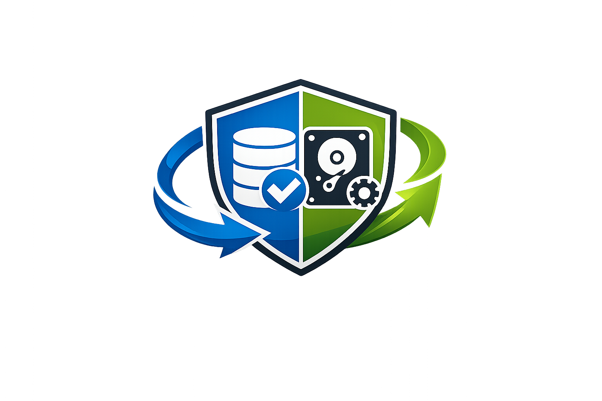

<p align="center">
  
</p>

# Backup Monitor

Backup Monitor is a Home Assistant custom integration for monitoring backup jobs from:

- Backrest
- Duplicati

It exposes backup status, timing, stale state, and run-now actions in Home Assistant.

## Current status
Early HACS-prep release track. Use internal/LAN endpoints for provider APIs.

## Recommended architecture
Home Assistant should talk to internal hostnames such as:

- `https://backrest.lan`
- `https://duplicati.lan`

Do not place Cloudflare or other CDN/WAF layers in front of the API endpoints used by Home Assistant.
Self-signed/internal TLS may require Verify TLS Off

## Installation
### Manual
Copy `custom_components/backup_monitor` into your HA config directory and restart Home Assistant.

### HACS
Coming soon.

## Features
- Config flow
- Backrest support
- Duplicati support
- Run-now buttons
- Last result / success / duration sensors
- Stale binary sensors

## Development

### Local setup
Create a Python virtual environment and install development dependencies:

```bash
python -m venv .venv
source .venv/bin/activate
pip install -r requirements_dev.txt